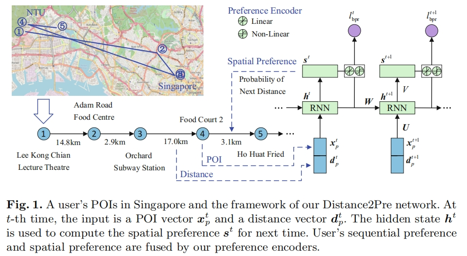

# Distance2Pre



This is the code for the PAKDD 2019 Paper: [Distance2Pre: Personalized Spatial Preference for Next Point-of-Interest Prediction](https://link.springer.com/chapter/10.1007/978-3-030-16142-2_23).

## Usage


## Requirements


## Citation

Please cite our paper if you use the code:

```
@inproceedings{cui2019distance2pre,
  title={Distance2pre: Personalized spatial preference for next point-of-interest prediction},
  author={Cui, Qiang and Tang, Yuyuan and Wu, Shu and Wang, Liang},
  booktitle={Advances in Knowledge Discovery and Data Mining: 23rd Pacific-Asia Conference, PAKDD 2019, Macau, China, April 14-17, 2019, Proceedings, Part III 23},
  pages={289--301},
  year={2019},
  organization={Springer}
}
```

## Contact information
If you have other questions or confusions, please send email to [cuiqiang1990@hotmail.com].
